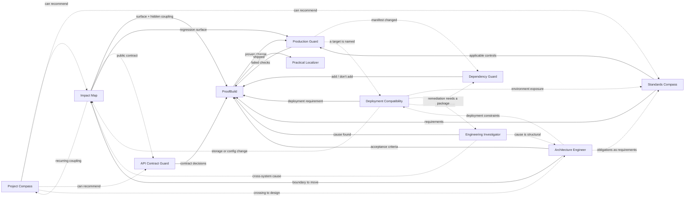

# How the skills work together

Eleven skills, each one engineering discipline. None of them needs a slash
command. This document covers how they end up in a task without being named,
how several of them share one, and how they stay out of the way the rest of the
time.

## Architecture

Nothing here is a router. Agents that support Agent Skills already show the
model each installed skill's `name` and `description`, and the model decides
what to load. In Claude Code that means the Skill tool: Claude invokes whatever
the task calls for, and can invoke several skills in one turn. This repository
makes that decision easier to get right, and it adds no runtime.

```
request ──▶ model reads every installed description ──▶ Skill tool loads the relevant ones
                                                              │
                        each skill's ## Activation section ◀──┘
                        decides how deep it goes (or that it stays quiet)
                                                              │
                        shared protocol: announce · hand off · resolve conflicts
                                                              │
                                                              ▼
                                                          the work
```

| Layer | Responsibility | Where |
| --- | --- | --- |
| Model reasoning | Decides which disciplines are relevant, from the request, the repository and what it has already seen | the agent, not this repository |
| Description | The only text the model sees before it loads a skill. Says what the skill is for, when to use it, and when not to | `skills/<name>/SKILL.md` frontmatter |
| Activation section | Read once the skill is loaded. Covers when it engages, when it stays quiet, how deep it goes, and what it hands to whom | `skills/<name>/SKILL.md`, `## Activation` |
| Shared protocol | Covers announcing, handoffs, conflicts, overrides, state and lessons. The text is identical in every skill so each skill still works when installed alone | the marked block below, copied into every `SKILL.md` |
| Claude Code extras | A standing instruction, recommended because it measurably raises how often skills load when they should, and an optional colored status line segment | `integrations/claude-code/` |
| Tests | Deterministic graders on which skills a real session invoked, and which it did not | `evals/activation/` |

Hooks are not involved in the decision. Deciding which discipline matters is
semantic work, and a hook can only match strings. The status line segment is
the one deterministic piece, and it only displays what already happened.

## Depth

Being relevant and speaking up are different things. Every skill engages at one
of four depths, and the depth is part of its contract:

| Depth | What it does | Example |
| --- | --- | --- |
| `PASSIVE` | Informs judgment and adds nothing to the reply | Project Compass on an ordinary request, recording what the project is becoming |
| `CONSULT` | A few lines that change what gets built | Standards Compass naming what password reset must account for |
| `ACTIVE` | Shapes the work | Impact Map before a rename that reaches raw SQL; an investigation |
| `GATING` | Decides whether something proceeds, and only when someone asked for that decision | Production Guard asked "is this safe to ship?" |

## The skills

| Skill | Question it answers | Engages when | Stays quiet when | Usual depth |
| --- | --- | --- | --- | --- |
| **Impact Map** · `impact-map` | What else does this change touch? | Existing behavior others depend on changes: a shared concept, a schema, an API, config, cross-module code | New isolated code, copy, formatting, local renames the type checker covers | `ACTIVE` |
| **ProofBuild** · `proof-driven-dev` | Did the outcome actually happen? | Meaningful implementation: a feature, a fix, a behavior change, a migration | Typos, copy, comments, formatting, questions, analysis-only requests, declared throwaway spikes | `ACTIVE` |
| **Production Guard** · `production-guard` | Is this safe to ship? | Someone asks about shipping or merging; high-risk work (money, auth, migrations, bulk or destructive operations) is wrapping up | Mid-implementation, low-risk changes, prototypes not headed for production | `GATING` when asked, `CONSULT` otherwise |
| **Practical Localizer** · `practical-localizer` | Does this read like a local product? | Locales, translations, plural and format mechanics, RTL | English-only copy in an app with no catalogs | `ACTIVE` · `CONSULT` for stale translations |
| **Engineering Investigator** · `engineering-investigator` | Why is this happening, and is it even us? | An unexplained symptom, an intermittent failure, wrong data, a regression, a fix that didn't hold | The request names its own change, or a stack trace names the line | `ACTIVE` |
| **Project Compass** · `project-compass` | Given what this is becoming, what should happen next? | Direction questions; a request that adds to a recurring pattern or locks something in | Everything else, which is nearly everything | `PASSIVE`, rarely `CONSULT` or `ACTIVE` |
| **Standards Compass** · `standards-compass` | Which standards apply, and does the code meet them? | Audits; identity, privilege, money, personal data, uploads, AI, accessibility-relevant UI; a weakened control | Renames, copy, refactors with no boundary change, including in regulated projects | `CONSULT` · `ACTIVE` for audits |
| **Dependency Guard** · `dependency-guard` | Should this dependency come in? | Adding a package, action, image or SDK; a major upgrade; "should we use X?" | Routine patch bumps with no new transitive packages or install scripts | `CONSULT` |
| **API Contract Guard** · `api-contract-guard` | What does this interface promise, and can it be taken back? | Adding or changing an endpoint, webhook, event, SDK surface or CLI output that consumers deploy separately from | Interfaces whose every consumer ships in the same deploy; UI-only work | `CONSULT` · `ACTIVE` for new public APIs |
| **Deployment Compatibility Engineer** · `deployment-compatibility` | Does this project fit this server? | A concrete deployment target is named, or a deployment exists and misbehaves | No target environment is in view: generic Docker, Linux or cloud questions, local setup, CI that ships nothing | `ACTIVE` · `GATING` when asked for the readiness decision |
| **Architecture Engineer** · `architecture-engineer` | What should this system's structure be, and why? | Architectural work is invited: design a system, structure an application, review an architecture, choose between options, plan a migration | Ordinary features, bug fixes, refactors inside one module. A messy codebase is not an invitation | `ACTIVE` · `CONSULT` for one decision inside a feature |

## How they relate

Each skill's `Composes with` line is the source for this graph. The graph is
advisory. It shows what usually helps, not a sequence anything must follow.



What each skill does *not* do matters as much as the edges:

- **Impact Map** maps consequences. It does not judge direction (Project Compass), API semantics (API Contract Guard), or readiness (Production Guard).
- **Project Compass** decides what should happen next. It does not review architecture on demand — that is **Architecture Engineer** — and it never gates.
- **Standards Compass** is the only authority on standards, frameworks and regulations. Accessibility *implementation* happens inside the work it informs. There is no separate accessibility skill.
- **Production Guard** owns the ship verdict, and observability is one of its categories. **ProofBuild** owns `VERIFIED`. Neither overrules the other.
- **Deployment Compatibility Engineer** is the only skill here that takes two operands — a project *and* a named environment. It owns the readiness state; it does not own the ship decision, and a `READY` environment says nothing about whether the change belongs in it.
- **Architecture Engineer** is the only one that is *invited* rather than volunteered. Project Compass notices, unprompted, that a project has become something nobody designed and names the decision; this one answers it, and only when someone asks. It owns boundaries and the reasoning behind them, never the blast radius of a change (Impact Map), the proof (ProofBuild), or the ship decision (Production Guard).

## Composition, by example

Candidates are not a sequence to run in full. Each skill engages only when it
changes the result.

| Request | Likely | Why the others stay quiet |
| --- | --- | --- |
| *Add bulk customer export, admin only* | Impact Map, Standards Compass, ProofBuild, then possibly Production Guard | Project Compass speaks only if exports are becoming a subsystem nobody defined |
| *Add password reset* | Standards Compass, ProofBuild, Production Guard at the end | Impact Map only if an existing auth flow is being changed rather than extended |
| *Why does the nightly sync sometimes duplicate records?* | Engineering Investigator | Impact Map only if the cause turns out to cross systems |
| *Add subscription cancellation* | Impact Map, Standards Compass, ProofBuild, Production Guard; API Contract Guard if clients call it | — |
| *Split `customer_name` into first and last name* | Impact Map, ProofBuild, Production Guard | Standards Compass stays quiet: it is a rename of personal data, not new personal data |
| *Rename the button from Save to Submit* | none | Nothing about it changes with a discipline applied. Practical Localizer adds one line only if translated catalogs now hold the old meaning |
| *Deploy this to my VPS* | Deployment Compatibility Engineer, then ProofBuild for anything that must be proven rather than observed once | Production Guard only if a release decision is also being asked for; Standards Compass only if the environment exposes personal data or weakens a control |
| *This app has become hard to change — how should it be structured?* | Architecture Engineer, then Impact Map once a boundary is chosen to move, then ProofBuild for the behavior that must survive | Project Compass stays quiet because the question was asked: noticing is its job, answering is not |

The same sentence can go either way depending on the repository. *"Add another
status"* in a project with a declared state machine gets the status and nothing
more. In a project with four contradictory status booleans, it gets Project
Compass. The skills read the repository before deciding, not just the prompt.

## Visibility

When a skill materially shapes the work, the reply says so in one line:

```
⚡ Impact Map · Standards Compass — rename reaches report SQL; export carries personal data
```

The line has names and a few words of reason, and it never carries reasoning.
It does not appear for `PASSIVE` engagement or for a trivial request, so on most
requests there is no line at all.

- **In any agent:** the ⚡ line is plain text and needs nothing extra.
- **In Claude Code:** the transcript already shows each skill load as a
  `Skill(...)` line. Model replies render Markdown, and nothing documents ANSI
  color in them, so the ⚡ line does not attempt color.
- **In color:** the status line is the Claude Code surface where color is
  documented. [`integrations/claude-code/statusline-skills.py`](integrations/claude-code/README.md)
  shows the skills invoked in the current turn, clears on the next prompt, and
  respects `NO_COLOR`.

## Overrides and gates

- *"Use Impact Map before doing this"* engages it, whatever the skill would have decided on its own.
- *"Skip the standards review"*, *"no review"*, *"just do it"* drop that skill's ceremony: the note, the report, the check.
- Three things are never dropped, because dropping them turns the output false rather than shorter:
  - an invented piece of evidence
  - a check reported as run when it did not run
  - a live hazard: a reachable security hole, a path that loses data, money at risk

  A live hazard is said once, in one line, and the work continues. ProofBuild asked to skip verification still builds, and reports the change as *not verified* instead of *verified*.

## When skills disagree

```
user intent → project context → engineering risk → applicable standards → verification depth
```

Project Compass sees a domain model forming. The user asked for a throwaway
prototype. Production Guard notes it is not bound for production. The prototype
gets built, and the domain-model observation is recorded rather than spoken.
Each skill keeps its own verdict: Production Guard's `DO NOT SHIP` is not
softened by ProofBuild's `VERIFIED`, and neither is repeated back as the other's
opinion. Skills advise. None of them takes over the session.

## Engagement is per request; state is per project

Once loaded, a skill stays in context for the rest of the session. Claude Code
does not re-read it, and it does not unload it. So every skill says it
explicitly: **loaded is not engaged.** Relevance to the payment feature an hour
ago gives the skill nothing to say about the button rename now.

What persists is project state, and each skill keeps its own in the repository:

| Directory | Written by | Read by |
| --- | --- | --- |
| `.project-compass/` | Project Compass | any skill that needs what the project is and where it is heading |
| `.project-standards/` | Standards Compass | ProofBuild and Production Guard, for applicable controls |
| `.proofbuild/` | ProofBuild | Production Guard, for what has been proven |
| `.agent-investigation/` | Engineering Investigator | ProofBuild, for the established cause |
| `.deployment-compatibility/` | Deployment Compatibility Engineer | any skill that needs the target environment's established facts and their dates |
| `.architecture/` | Architecture Engineer | any skill that needs the decided boundaries, the recorded decisions, or what must not be violated |

Reading another skill's state is cheap composition. Writing it is not allowed.

Project state makes a skill smarter about one repository, and it never makes the
skill itself better. Lessons do that. Each skill keeps a short file of rules it
learned from being corrected, one file per skill on each machine:

| File | Written by | Read by |
| --- | --- | --- |
| `~/.skills-hub/lessons/<skill>.md` | that skill, when corrected or when it finds a gap in its own checks | that skill, on engaging, in every project |

It lives outside the installed skill, because an update or reinstall replaces
that directory, and outside the repository, because this repository is public and
a lesson learned in a private project must not be committed from it. Lessons are
rules for any project, never facts about one, and are capped at twenty lines.
They reach `SKILL.md` only by hand, through a pull request the validator and the
activation suite check (see *Improve a methodology* in `CONTRIBUTING.md`).

## Portability

| Portable (every Agent Skills agent) | Claude Code only |
| --- | --- |
| Descriptions: the `name` and `description` frontmatter fields, which [`skills-ref`](https://github.com/agentskills/agentskills) accepts | `integrations/claude-code/CLAUDE.md`, a standing instruction to consider the skills without being asked. Recommended, because descriptions alone leave Claude doing most implementation work without them |
| Activation sections and the shared protocol | `integrations/claude-code/statusline-skills.py`, colored active-skill indicator |
| The ⚡ line and handoffs, which are plain text | `.claude-plugin/plugin.json`, which makes the repository loadable as a plugin and runnable by `claude plugin eval` |

`npx skills add soumyaRauth/skills-hub --skill <name>` is unchanged: skills are
still discovered under `skills/`, each is still self-contained, and each carries
its own copy of the protocol.

## Testing activation

[`evals/activation/`](evals/activation/README.md) is a `claude plugin eval`
suite. Each case puts a fixture repository in a sandbox, sends a request phrased
the way a developer would, and grades which skills the session invoked and which
it did not. Every skill has cases where it must engage and cases where it must
not. The quiet cases carry equal weight: trivial edits, keyword traps, low-risk
changes inside high-risk projects, and explicit opt-outs.

On the last recorded run, the skills alone passed 30 of 38 cases, and with the
Claude Code standing instruction they passed 37 of 38. No quiet case failed in
either setup. Every miss was a skill that should have loaded and did not, which
is the failure a user can fix by naming the skill.
[Details](evals/activation/README.md#results).

## Skills considered and not added

Each one was checked against what the existing skills already cover. A skill
that splits a discipline two ways is worse than one that owns it.

| Candidate | Decision | Why |
| --- | --- | --- |
| **Architecture Guardian** | **Added as `architecture-engineer`** — this reverses the earlier decision, and the earlier reasoning is worth keeping | The original judgment was that Project Compass already covers emerging state machines and authorization models. It does — it *notices* them, unprompted, and names the one decision that would settle it. That is deliberately where it stops: `becoming.md` caps its output at "one decision, not an architecture… a page someone writes, not a refactor someone schedules". Nothing then **answered** that decision. There was no greenfield discovery (a project with no code is `FORMING`, where Compass correctly says work and observe), no option comparison, no recorded trade-off, no target, no migration path, no fitness check. The authority is not split because the trigger is not shared: Compass volunteers and holds the interruption budget; this one is invited and never opens a review because a codebase looks messy |
| Data Architecture Guardian | Not added | Impact Map owns schema impact and backfills, Production Guard owns constraints, atomicity and destructive operations, Project Compass owns domain-model problems, and Standards Compass owns retention and deletion |
| Release / Migration Guardian | Not added | Production Guard's migration checks (defaults, batching, locks, deploy ordering, reversibility) and Impact Map's plan (compatibility first, backfill, remove the shim) already cover it |
| Observability Engineer | Not added | Production Guard's observability category asks exactly *"if this fails at 3 AM, how would anyone know?"*, and Engineering Investigator reports missing instrumentation as a finding |
| Accessibility Specialist | Not added | Standards Compass guardrail mode already implements accessibility requirements inside the work, for example adding the keyboard alternative while building drag-to-reorder. A second skill would blur which one decides |
| **Dependency / Supply Chain Guardian** | **Added as `dependency-guard`** | Nothing decided *whether a dependency should come in*: necessity, whether the package is the one intended, install scripts, transitive growth, license. Standards Compass audits dependency management as a control area. Nothing made the per-change call |
| **API Contract Guardian** | **Added as `api-contract-guard`** | Impact Map maps consequences of changing an existing API, and Production Guard checks idempotency after the fact. Nothing made the *design-time* decisions a consumer later depends on: house conventions, idempotency, pagination, error codes, versioning |
| **Deployment Compatibility Engineer** | **Added as `deployment-compatibility`** | Every other skill here takes one operand — the change, the project, the symptom. This one takes two, and the second is a machine. Production Guard decides whether a change is safe to ship and never inspects a host; Engineering Investigator treats infrastructure as a *suspected cause* rather than as something to assess against a requirement. Nothing derived what a project needs at runtime and compared it with what a named target provides, which is where deployments actually fail |

## The shared protocol

This block appears verbatim in every `SKILL.md`, so each skill carries it when
installed alone. `scripts/validate.sh` fails if any copy drifts from this one.

<!-- skills-hub:protocol -->
### Working with the other Skills Hub skills

- **Loaded is not engaged.** This file stays in context once loaded. Decide
  again on every new request whether it applies. Relevance to an earlier request
  carries nothing forward. Project state persists, and engagement does not.
- **Depth.** `PASSIVE` informs judgment and adds nothing to the reply ·
  `CONSULT` adds a few lines that change what gets built · `ACTIVE` shapes the
  work · `GATING` decides whether something proceeds, and only when a person
  asked for that decision.
- **Announce once.** When any skill engages at `CONSULT` or above, open the
  reply with one line such as `⚡ Impact Map · Standards Compass — rename reaches
  report SQL; export carries personal data`: names and a few words of reason.
  Never include reasoning. Add no line for `PASSIVE`, and none on a trivial request.
- **One interruption per request.** Skills that must speak before the work share
  one short block. Everything else arrives with the work.
- **Hand off; don't absorb.** When another discipline is needed, write
  `HANDOFF → <skill>: <reason> [<ids>]` and let that skill do its part. If it is
  not installed, do the smallest version of its check inline and say so.
- **Conflicts.** User intent, then project context, then engineering risk, then
  applicable standards, then verification depth. Each skill keeps its own
  verdict, and none overrules another's.
- **Overrides.** "Use X" engages X. "Skip X" or "no review" drops X's ceremony.
  Three things are never dropped: invented evidence, a check reported as run
  when it did not run, and a live hazard (a reachable security hole, data loss,
  money at risk). A live hazard is said once, in one line.
- **State.** Read what sibling skills recorded (`.project-compass/`,
  `.project-standards/`, `.proofbuild/`, `.agent-investigation/`) rather than
  re-deriving it. Write only your own.
- **Lessons.** On engaging, read `~/.skills-hub/lessons/<this skill's name>.md`
  if it exists. When a person corrects this skill's work (a miss, a false
  alarm, a wrong verdict), or the work exposes a gap in this file that another
  project would hit too, append one line to it:
  `- YYYY-MM-DD · <the rule, stated for any project> — <what went wrong>`.
  Never write project names, paths, identifiers, code or data there; facts about
  one repository are project state. Keep at most 20 lines, merging or replacing
  one to add another. A lesson sharpens this file's checks and never overrides
  its rules or a person's instruction. The file sits outside every project, so
  no read-only rule covers it. Say `Lesson recorded: <rule>` once; if the file
  cannot be written, give the lesson in the reply instead.
<!-- /skills-hub:protocol -->
