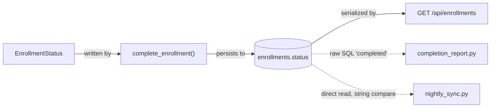

# Impact Map

An Agent Skill that answers one question before you write any code:

> **Before I change this, what else could this change affect?**

Impact Map turns a change request into an evidence-based blast-radius report:
what is affected, *why* it is affected, how it is connected, how confident the
analysis is, and what should happen next.

---

## Why it exists

The common failure mode:

```
ticket → find the obvious file → change it → discover later what broke
```

What actually breaks is rarely the obvious file. It is the raw SQL in a report,
the string comparison in a nightly job, the fixture that keeps the test suite
green while the behavior is wrong, the policy that never learned about the new
state.

Impact Map inserts a read-only analysis step:

```
ticket → impact map → architecture → dependencies → hidden coupling
       → tests → risks → implementation plan → coding
```

---

## What makes it different from "find related files"

A generic search gives you:

```
File A
File B
File C
```

Impact Map gives you, for each finding: the symbol, the relationship, the
evidence observed in the repository, a confidence level, and the concrete action.
Findings are classified:

| | Meaning |
| --- | --- |
| 🟥 **MUST CHANGE** | Strong evidence this location requires modification. |
| 🟧 **LIKELY AFFECTED** | Strong relationship; needs confirmation. |
| 🟨 **NEEDS VERIFICATION** | Plausible relationship; check before implementing. |
| ⚠️ **HIDDEN COUPLING** | Indirect dependency — raw strings, SQL, config, duplicated logic, fixtures, serialization, co-change history. |
| ⬜ **OUT OF SCOPE** | Inspected, not materially related. |

Speculation is never presented as fact, and low-confidence findings are never
promoted to MUST CHANGE. Each finding carries a stable id — `F1`, `F2`, … — and
the architecture graph, the risk table, and the implementation plan all point
back at those ids.

---

## When to use it

- Before changing business logic, shared services, or state machines
- Before schema or API contract changes
- When working in an unfamiliar or legacy codebase
- When a change crosses modules, layers, or teams
- Before touching authentication, authorization, or permissions
- Before changing anything consumed by jobs, reports, exports, or integrations
- During code review, to check whether a change covered its surface

## When not to use it

- Typos, copy changes, formatting, dependency bumps
- Greenfield code with no existing consumers
- You already know the surface and the change is one file
- You need the code written *now* — Impact Map deliberately stops before
  implementation

Running it on a two-line change is not dangerous, just slower than reading the
file.

---

## Installation

```bash
npx skills add soumyaRauth/skills-hub --skill impact-map
```

For Claude Code specifically:

```bash
npx skills add soumyaRauth/skills-hub --skill impact-map --agent claude-code
```

The CLI writes the skill into your agent's skills directory; no other setup,
server, or API is required.

### Invoking it

Installed skills are selected by their description, so you invoke Impact Map by
asking for what it does — no slash command:

```
What's the blast radius of adding an approval step to course completions?
Before you change anything, map the impact of renaming this status.
Deep impact analysis on switching the notification provider.
```

You can also name it directly: *"Use the impact-map skill on this ticket."*

---

## Usage

### Normal analysis

```
You:   Add approval status to course completion.

Agent: I'll map the impact surface before changing anything.
       …
       IMPACT MAP
       ────────────────────────────────────────
       REQUEST
       Introduce approval_status into course completion and expose it
       through the existing API and UI.
       …
       Want me to turn this into an implementation plan?
```

### Deep analysis

Trigger with *deep analysis*, *full impact analysis*, *blast radius*,
*thorough*, or *comprehensive*. Deep mode adds sweeps for reverse references,
raw strings, raw SQL, configuration, generated artifacts, events, jobs,
permissions, reports, fixtures, external boundaries, duplicated business logic,
co-change history for every concept, and — in a monorepo — every dependent
package rather than the direct ones alone.

Deep mode means more investigation, not a longer file list.

| | Normal | Deep |
| --- | --- | --- |
| Repository reconnaissance | ✅ | ✅ |
| Direct dependency tracing | ✅ | ✅ |
| Cross-layer inspection | ✅ | ✅ |
| High-value hidden coupling | ✅ | ✅ |
| Exhaustive string / SQL / config sweep | — | ✅ |
| Events, jobs, schedules, permissions | as relevant | ✅ |
| Fixtures, generated code, external boundaries | as relevant | ✅ |
| Co-change history per concept | high-value only | ✅ |
| Transitive dependent packages | direct only | ✅ |

### Monorepos

In a workspace the question is *which packages*, not *which files*. The skill
reads the workspace config (pnpm, npm/yarn, Turborepo, Nx, Lerna, Rush, Go,
Cargo, Gradle, Maven, .NET), builds the package graph, finds the package the
change originates in, and inverts the graph to get its dependents. Scope follows
that graph — not directory proximity — and the report states it:

```
REPOSITORY SCOPE

Workspace:     pnpm, 14 packages
Change origin: packages/domain
In scope:      packages/domain, packages/api, apps/web, apps/admin
Not inspected: apps/mobile — consumes @org/api-client only, no reference found
Published:     @org/domain — consumers outside this repository are not
               enumerable here
```

Partial coverage that names its boundary is useful. Partial coverage presented
as complete is the failure this skill exists to prevent.

### History and ownership

Git holds coupling evidence the working tree does not: which files engineers
keep changing together. A file that appears in most of a concept's commits with
no import between them is **temporal coupling** — reported as hidden coupling at
Medium confidence, because history proves correlation, not causation.

The same pass reads churn (unsettled code, or code nobody has touched in years)
as a risk input, and `CODEOWNERS` as review routing — which team this change
needs, never attribution or a judgment about anyone's work.

When history is unusable — shallow CI clone, squash merges, a single founding
commit — the skill says which condition applies instead of quietly reporting
nothing.

### Analyzing a change you already made

Point it at a diff instead of describing a plan:

```
Impact-map the changes on this branch.
What did this PR miss?
```

The change statement is derived from what the code now does, the diff's symbols
and literals become the primary concepts, and then the already-changed files are
subtracted. **What remains is the finding** — the surface the change touches but
has not visited.

### Architecture graph

When the surface branches or crosses three or more layers, the report draws it:
one subgraph per layer the repository actually has, nodes labelled by finding
id, and **every edge labelled with its relationship**. Solid edges are hard
(import, call, foreign key); dashed edges are soft (string, raw SQL, config,
convention, co-change) — the ones that break quietly.



The graph renders findings that are already in the report — no node without a
location in the repository, no suspected edge drawn as fact, and anything
collapsed is named. A linear surface gets the chain and no graph.

### Risk score

`RISK` is a scored argument rather than a verdict. Six factors — breadth,
coupling opacity, test coverage, reversibility, consumer reach, area volatility
— each scored 0–3 from what the analysis observed and printed with the
observation that set it:

```
Risk score: 15 / 18 → High

Breadth             3   backend, frontend, jobs, and reporting all in scope
Coupling opacity    3   raw SQL, a direct-read job, a duplicated UI comparison
Test coverage       3   no test asserts report or sync behavior for this status
Reversibility       2   value rename with a backfill of existing rows
Consumer reach      3   a partner system reads the value; BI consumers are
                        suspected and not enumerable from this repository
Area volatility     1   normal churn, except one stale job
```

The factor table is mandatory — a total without its factors is the invented
number this skill forbids. A factor that could not be assessed is scored `?` and
the total becomes a lower bound (`8+ / 18`), never rounded down. Floors (an
irreversible migration, an unreachable external consumer) raise the band; the
band is never lowered.

It is not a quality metric, not a percentage, and not comparable between
repositories.

### Implementation plan

The map stops before implementation. Ask for the plan and you get a **handoff
artifact** — executable by an engineer, or by a fresh agent session that never
saw the analysis, without re-reading anything. Still no code.

```
STEP 2 — Rename the enum member and its stored value

  Files:      backend/models/enrollment.py
              backend/services/enrollment_service.py
  Resolves:   F1, F2
  Depends on: Step 1 deployed.
  Change:     Rename the member and its value; update the typed writer in the
              same step — the rename breaks it, so they are one commit.
  Evidence:   F1 — COMPLETED = "completed", member and stored string both carry
              the old name. F2 — the sole typed writer.
  Verify:     The existing service test passes against the new member; the type
              checker reports no remaining references to the old name.
  Rollback:   Revert. Step 1 left every reader tolerant of both values.

COVERAGE
  F1 → step 2   F2 → step 2   F3 → step 4   F5 → prerequisite   …
  Deferred: none      Unmapped: none
```

What makes it a handoff rather than a to-do list:

- **Coverage is checked, not assumed.** Every finding id maps to a step. Each 🟥
  is resolved by exactly one step — a 🟥 with no step is an invalid plan. Every
  ⚠️ gets a step or a recorded decision, and every 🟨 becomes a prerequisite
  resolved *before* the steps that depend on it.
- **Every step leaves the system working.** Prerequisites, then compatibility
  (dual-read, dual-emit), then the change innermost outward, then backfills,
  then the coverage for the quiet paths, then removing the shim. One commit per
  step.
- **Verification is an observation** — an existing test path, a described
  assertion, or a command whose output shows it worked. Never "verify it works",
  and never a test the analysis did not observe.
- **Drift is reported.** If implementation contradicts the map, the rule is to
  stop and name the finding that changed, not to re-plan quietly.

Worked example: [`examples/implementation-plan.md`](examples/implementation-plan.md).

### Example output

Abbreviated. Full worked examples are in [`examples/`](examples/) — illustrative reports written to show the expected shape and rigor, not transcripts of a particular run.

```
🟥 MUST CHANGE

app/Services/CourseCompletionService.php

  Symbol:         CourseCompletionService::complete()
  Relationship:   Writes CourseCompletion.status during the completion workflow.
  Evidence:       Line 42 sets $completion->status = CompletionStatus::COMPLETED
                  and is the only writer found for that field.
  Confidence:     High
  Action:         Set approval_status alongside status in the transition.

⚠️ HIDDEN COUPLING

app/Reports/CompletionReport.php

  Coupling type:  Raw SQL
  Evidence:       WHERE status = 'completed' — string literal, not the enum.
  Confidence:     High
  Action:         Decide whether the report should now count approved
                  completions only.

RISK

Risk score: 9 / 18 → Medium

Breadth             2   persistence, domain, API, authorization, reporting
Coupling opacity    2   a raw-SQL report and a fixture carry the status literal
Test coverage       2   the transition is covered; the report is not
Reversibility       1   additive column, but the backfill decision has no default
Consumer reach      1   API consumers are all in this repository
Area volatility     1   normal churn across the surface
```

---

## How it works

There is no engine, index, or server. The skill is a **workflow and reasoning
methodology** that directs the coding agent's own repository inspection:

1. **Understand the request** → a one-sentence change statement
2. **Repository reconnaissance** → the actual structure, not assumed conventions
3. **Find primary concepts** → progressive search across naming conventions
4. **Dependency analysis** → upstream callers and downstream dependencies
5. **History and ownership** → co-change coupling, churn, who reviews this
6. **Cross-layer analysis** → UI → API → service → model → database, plus
   events, jobs, permissions, reports
7. **Hidden coupling** → strings, SQL, config, duplicated logic, fixtures
8–12. **Database, API, authorization, test, and external boundary impact**

Then classification, confidence, the architecture graph, the scored risk table,
and the report.

Reference material the agent consults when it needs depth:

- [`references/report-schema.md`](references/report-schema.md) — report structure and finding fields
- [`references/dependency-analysis.md`](references/dependency-analysis.md) — upstream/downstream tracing
- [`references/hidden-coupling.md`](references/hidden-coupling.md) — indirect-coupling search patterns
- [`references/framework-detection.md`](references/framework-detection.md) — per-ecosystem reconnaissance
- [`references/git-signals.md`](references/git-signals.md) — co-change, churn, ownership, diff-driven analysis
- [`references/monorepo.md`](references/monorepo.md) — workspace detection, package graph, scoping
- [`references/architecture-graph.md`](references/architecture-graph.md) — graph conventions and honesty rules
- [`references/risk-scoring.md`](references/risk-scoring.md) — the six-factor risk rubric
- [`references/implementation-plan.md`](references/implementation-plan.md) — plan structure and handoff contract

---

## Read-only by design

During impact analysis the skill does not modify source files, create
migrations, edit configuration, install packages, delete files, commit, push, or
"fix" what it finds. It reads files, git metadata, and dependency manifests.

Implementation happens only when you explicitly ask for it, after the map.

---

## Team customization

Copy [`references/company-architecture.template.md`](references/company-architecture.template.md)
to `references/company-architecture.md` and fill in your conventions — domain
boundaries, layer locations, naming patterns, shared modules, integrations,
business terminology, standing risks. The skill reads it during reconnaissance,
where it overrides generic framework assumptions.

Keep internal details out of public forks.

---

## Pairs with Production Guard

[Production Guard](../production-guard/README.md) is the other half of the loop.
Impact Map runs *before* implementation and maps what a change will touch;
Production Guard runs *after* and validates that what was built is safe to ship.

```
ticket → impact-map → implement → production-guard → ship
```

Neither requires the other.

---

## Limitations

- **Instruction-driven, not a static analyzer.** Results depend on the agent
  and the repository. Coverage is not guaranteed or provable.
- **It can miss things.** Dynamic dispatch, reflection, runtime configuration,
  and generated clients are exactly where automated reasoning is weakest.
- **It only sees this repository.** Consumers in other repos, other services, or
  a data warehouse appear as open questions at best.
- **Large monorepos** need scoping — point it at the relevant packages.
- **It does not run your tests** and cannot prove a finding is complete.
- Treat the output as a well-evidenced starting point for engineering judgment,
  not a certificate of completeness.

---

## License

MIT — see [`LICENSE`](../../LICENSE) at the repository root.
