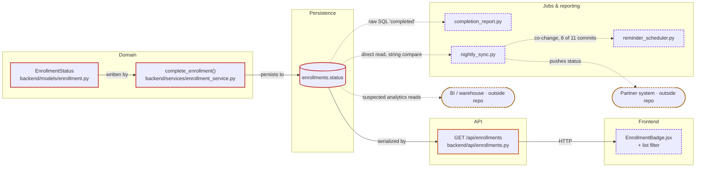

# Example 4 — Cross-module enterprise workflow change

A mixed-stack system (Python backend, React frontend, async jobs, SQL reporting)
where a status value is renamed. Run in **deep mode**. Shows why a rename that
the type checker "confirms is complete" is the classic production incident.

## Request

> Rename the `COMPLETED` enrollment status to `APPROVED`. Deep analysis please —
> this touches reporting and the nightly sync.

**CHANGE STATEMENT:** Rename the enrollment status value `COMPLETED` to
`APPROVED` across the domain, persistence, API, frontend, async jobs, and
reporting.

**INTERPRETATION:** This is a rename of an existing state, not the addition of a
new one — the set of states stays the same size. The stored string value in the
database is assumed to change too, which is what makes this a data migration and
not just a code rename.

## Change surface

The enum and its writers, the persisted column values, three consumers that
compare the literal string rather than the enum, a raw-SQL report, a nightly
sync job, and the frontend badge. Deep mode additionally swept configuration,
fixtures, and documentation.

## 🟥 MUST CHANGE

```
F1 · backend/models/enrollment.py

  Symbol:         EnrollmentStatus.COMPLETED
  Relationship:   Defines the value being renamed; the source of truth for every
                  typed reference.
  Evidence:       `COMPLETED = "completed"` — the member name and the stored
                  string both carry the old name.
  Classification: 🟥 MUST CHANGE
  Confidence:     High
  Action:         Rename the member and its value. Renaming only the member and
                  leaving the string would make this change invisible to the
                  data and to every string comparison below.
```

```
F2 · backend/services/enrollment_service.py

  Symbol:         complete_enrollment()
  Relationship:   Sole typed writer of the status.
  Evidence:       `enrollment.status = EnrollmentStatus.COMPLETED`.
  Classification: 🟥 MUST CHANGE
  Confidence:     High
  Action:         Update the reference; rename the method if the domain
                  vocabulary is changing too.
```

```
F3 · Data migration for enrollments.status

  Relationship:   Existing rows store the literal `'completed'`.
  Evidence:       The enum persists its value, and the reporting SQL matches on
                  `'completed'`, confirming the stored representation.
  Classification: 🟥 MUST CHANGE
  Confidence:     High
  Action:         Backfill `'completed'` → `'approved'`. Sequence it against the
                  deploy so no code reads a value the other half does not know.
```

## 🟧 LIKELY AFFECTED

```
F4 · backend/api/enrollments.py

  Relationship:   Serializes status into API responses; consumers receive the
                  literal string.
  Evidence:       Returns `enrollment.status.value` in the payload.
  Classification: 🟧 LIKELY AFFECTED
  Confidence:     High
  Action:         No code change needed if the value is passed through, but the
                  wire format changes — every consumer of the API is affected.
                  Confirm whether the API should keep emitting the legacy value.
```

## 🟨 NEEDS VERIFICATION

```
F5 · Downstream warehouse / BI consumers

  Relationship:   Reporting SQL suggests enrollment status is consumed
                  analytically; dashboards outside this repository may filter on
                  the literal.
  Evidence:       backend/reports/completion_report.py issues raw SQL against
                  the table; no warehouse definitions exist in this repository.
  Classification: 🟨 NEEDS VERIFICATION
  Confidence:     Low
  Action:         Ask the data team before the backfill. A silent rename breaks
                  dashboards without breaking any test.
```

## ⚠️ HIDDEN COUPLING

```
F6 · backend/reports/completion_report.py

  Coupling type:  Raw SQL
  Evidence:       `WHERE status = 'completed'` inside a raw query — never
                  touches the enum.
  Relationship:   Produces the completion metrics; silently returns zero rows
                  after the rename.
  Classification: ⚠️ HIDDEN COUPLING
  Confidence:     High
  Action:         Update the predicate in the same change as the backfill.
```

```
F7 · backend/jobs/nightly_sync.py

  Coupling type:  Raw string + direct data access
  Evidence:       `if row["status"] == "completed":` while querying the table
                  directly, bypassing the service layer.
  Relationship:   Decides which enrollments to push to the partner system.
  Classification: ⚠️ HIDDEN COUPLING
  Confidence:     High
  Action:         Update the comparison. Also confirm what the partner system
                  expects on the wire — it may need the old value preserved at
                  the boundary.
```

```
F8 · frontend/src/components/EnrollmentBadge.jsx

  Coupling type:  Raw string + duplicated business logic
  Evidence:       `status === 'completed'` in the badge, plus a second copy of
                  the same comparison in the list filter.
  Relationship:   Renders the completion state to users.
  Classification: ⚠️ HIDDEN COUPLING
  Confidence:     High
  Action:         Update both copies. Consider a shared constant so the next
                  rename has one site instead of two.
```

```
F9 · Fixtures and seed data

  Coupling type:  Fixture
  Evidence:       Test fixtures and the local seed script both write the literal
                  `"completed"`.
  Classification: ⚠️ HIDDEN COUPLING
  Confidence:     High
  Action:         Update together with the enum, or tests will keep asserting
                  the old world.
```

```
F10 · backend/jobs/reminder_scheduler.py

  Coupling type:  Temporal (co-change)
  Evidence:       Changed in 8 of the 11 commits that touched
                  EnrollmentStatus, with no import, string literal, or query
                  referencing it. Reading it shows it consumes the rows the
                  nightly sync writes.
  Relationship:   Suspected downstream of the sync job (F7); the code does not
                  say so, the history does.
  Classification: ⚠️ HIDDEN COUPLING
  Confidence:     Medium
  Action:         Read it before implementing. History says these two move
                  together for a reason this analysis has not established.
```

## Dependency paths

```
EnrollmentStatus.COMPLETED = "completed"          ← the change
  ↓ written by
enrollment_service.complete_enrollment()
  ↓ persisted to
enrollments.status                                (existing rows hold 'completed')
  ├─→ read by raw SQL in completion_report.py     ⚠️ string, not enum
  ├─→ read directly by nightly_sync.py            ⚠️ string, bypasses service
  └─→ serialized by api/enrollments.py
        ↓ HTTP
      frontend EnrollmentBadge.jsx                ⚠️ string comparison ×2
        and unknown BI consumers                  🟨 unverified
```

The three ⚠️ hops carry no import, no type reference, and no test that fails at
build time. They are the reason this change is High risk.

## Architecture graph



`enrollments.status` (F3) is the convergence point — four of the five consumer
paths read it, and three of those read it *around* the service that owns the
rule. Two edges leave the repository and cannot be verified from here.

## History and ownership

- **Co-change:** `completion_report.py` appears in 7 of the 11 commits that
  touched `EnrollmentStatus`, and `reminder_scheduler.py` in 8 — the second one
  has no textual reference to the enum at all (F10).
- **Churn:** `nightly_sync.py` was last touched 14 months ago and has one
  contributor; it is the least-understood file in the change surface and the
  one with a partner contract behind it.
- **Ownership:** `CODEOWNERS` routes `backend/reports/` to the data platform
  team. Their review is needed for F6 regardless of who writes the change.

## Database impact

- Backfill required; the column is a plain string, so nothing enforces
  consistency during the transition.
- Sequencing matters: with a single-shot rename, code and data must switch
  together. Safer path is dual-read — accept both values in application code,
  backfill, then drop the legacy value.
- Check for indexes or partial indexes on the column before a large `UPDATE`.

## API impact

The response value changes. Backward compatible only if the API translates at
the boundary. Options: break and coordinate, translate on the way out for one
release, or version the endpoint. The nightly sync's partner contract deserves
the same question.

## Test impact

- Service tests protect the completion transition and will catch the typed path.
- Nothing protects the raw-SQL report, the sync job's string comparison, or the
  frontend badge. Every hidden-coupling finding above is untested — which is
  precisely why they survive a rename.
- Worth adding: one test asserting the report returns rows for approved
  enrollments, and one asserting the sync selects them.

## Risk

**Risk score: 15 / 18 → High**

```
Breadth             3   backend, frontend, jobs, and reporting all in scope
Coupling opacity    3   raw SQL, a direct-read job, a duplicated string
                        comparison in the UI, and one file coupled only in
                        history
Test coverage       3   no test asserts report or sync behavior for this status
Reversibility       2   value rename with a backfill of existing rows
Consumer reach      3   the partner system consumes the value through the
                        sync job, and BI consumers are suspected (F5) but not
                        enumerable from this repository
Area volatility     1   normal churn, except the stale sync job noted above
```

Two floors apply independently of the total: consumer reach is unresolved
behind an unversioned wire format, and test coverage 3 combined with coupling
opacity 3 means nothing in CI fails if the quiet paths are missed.

## Recommended implementation order

1. Confirm the BI/warehouse consumers and the partner-system contract.
2. Make application code accept both values (dual-read) so deploy order stops
   mattering.
3. Rename the enum member and value.
4. Update the service writer.
5. Update the raw SQL report and the nightly sync comparison.
6. Update the frontend badge and list filter.
7. Update fixtures and seeds; add coverage for the report and sync paths.
8. Backfill the data.
9. Remove the dual-read compatibility once no `'completed'` rows remain.

## Open questions

- Does any dashboard or warehouse model filter on `'completed'`?
- Does the partner system in the nightly sync expect the literal value?
- Should the API translate at the boundary for a deprecation window, or break
  in one release?
