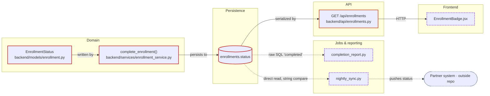

# Architecture Graph

The dependency chains say how one path works. The graph says what the whole
change surface looks like at once — which layers it spans, where the paths
converge, and which edges are the quiet ones.

It is a **rendering of findings already in the report**, never a source of new
claims. Every node is a finding or a real location; every edge is a relationship
that was observed. A box drawn because the architecture "usually" has one is a
fabrication with better graphics.

## When to draw it

| Surface | Output |
| --- | --- |
| One linear path | Chain only. A graph of a straight line adds nothing. |
| Branching, or crossing three or more layers | Graph **and** chains. |
| More than ~20 nodes | Collapse to module level, and say what was collapsed. |

The chains stay in the report either way: the graph shows the shape, the chains
carry the relationship and evidence at each hop.

## Node identity

Findings carry stable ids (`F1`, `F2`, …) assigned in report order. The graph
uses those ids so the reader can go from a box straight to the evidence, and so
the implementation plan can say which findings a step resolves.

Nodes that are not findings — a table, a queue, an external system — get a
descriptive id (`db_enrollments`, `partner_api`) and are shaped differently.

## Mermaid form



Conventions:

- **Subgraph per layer**, using the layers this repository actually has (Phase 6),
  not a textbook stack.
- **Node style by classification** — must change, likely affected, needs
  verification, hidden coupling, and out-of-repository.
- **Solid edge = hard edge**: import, call, foreign key, type reference. Breaks
  loudly.
- **Dashed edge = soft edge**: string match, raw SQL, convention, config,
  reflection, generated client, co-change. Breaks quietly, and is where the
  incidents come from.
- **Every edge is labeled** with the relationship. An unlabeled arrow is
  decoration.
- Shapes: `[ ]` code, `[( )]` datastore, `([ ])` external boundary.

Do not add a legend the report already states in words, and do not colour-code
anything that has no meaning.

## ASCII form

For terminals and diff-friendly output, or when the surface is small:

```
                        EnrollmentStatus.COMPLETED  (F1) 🟥
                                   │ written by
                        complete_enrollment()       (F2) 🟥
                                   │ persists to
                        enrollments.status          (F3) 🟥
              ┌────────────────────┼────────────────────┐
    raw SQL ⋯⋯┤                    │ serialized by      ├⋯⋯ direct read
  completion_report.py (F6) ⚠️   GET /api/enrollments (F4) 🟧   nightly_sync.py (F7) ⚠️
                                   │ HTTP                        ⋮ pushes status
                        EnrollmentBadge.jsx (F8) ⚠️        partner system (outside repo) 🟨
```

Solid `│ ─` for hard edges, dotted `⋯ ⋮` for soft ones — the same distinction the
mermaid form makes with dashes.

## Reading the graph

Three shapes are worth calling out in one line under the diagram:

- **Convergence** — many paths through one node. That node is the safe place to
  put the change, and the dangerous place to get it wrong.
- **Bypass** — an edge that skips the layer that owns the rule (a job reading the
  table directly). Every bypass is a second implementation of the logic.
- **Leaf outside the repository** — an edge leaving for a partner, a warehouse,
  or a published package. It cannot be verified here and caps the report's
  claim to completeness.

## Honesty rules

1. No node without a location in the repository, or an explicit
   "outside this repository" marker.
2. No edge without an observed relationship. Suspected edges are drawn dashed
   **and** appear as NEEDS VERIFICATION findings — never drawn as fact.
3. The graph never contradicts the findings list. If it does, the findings are
   right and the graph is wrong.
4. Collapsed or omitted regions are named ("18 UI components consuming the hook,
   collapsed to one node"). A tidy diagram that hides half the surface is worse
   than no diagram.
